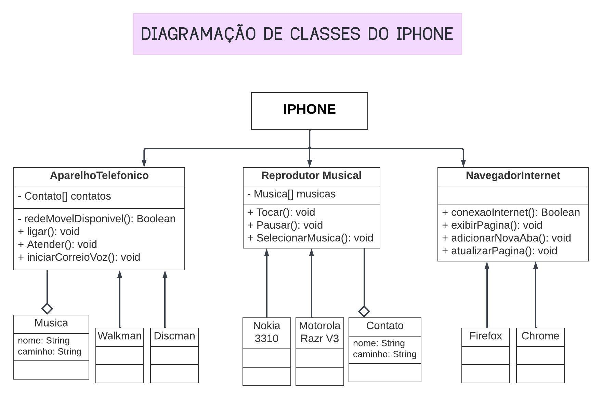

# Projeto Diagramação do iPhone

Este projeto é uma implementação simples das funcionalidades de um iPhone utilizando Java. Ele inclui classes e interfaces para representar o iPhone como um Reprodutor Musical, Aparelho Telefônico e Navegador na Internet.

## Diagrama de Classes e Interfaces

A seguir está o diagrama de classes e interfaces do projeto:

## Funcionalidades

O projeto inclui as seguintes funcionalidades para o iPhone:

- Ligar e desligar o iPhone
- Reproduzir e pausar músicas
- Fazer e receber ligações telefônicas
- Navegar na internet e abrir páginas web

## Como Executar

Para testar as funcionalidades do iPhone, você pode executar a classe `Main`. Certifique-se de ter configurado corretamente o ambiente de desenvolvimento Java.

## Contribuição

Contribuições são bem-vindas! Se você quiser contribuir com melhorias ou correções para este projeto, sinta-se à vontade para abrir uma issue ou enviar um pull request.

&nbsp;

## RENATA RIBEIRO

  

  

  

